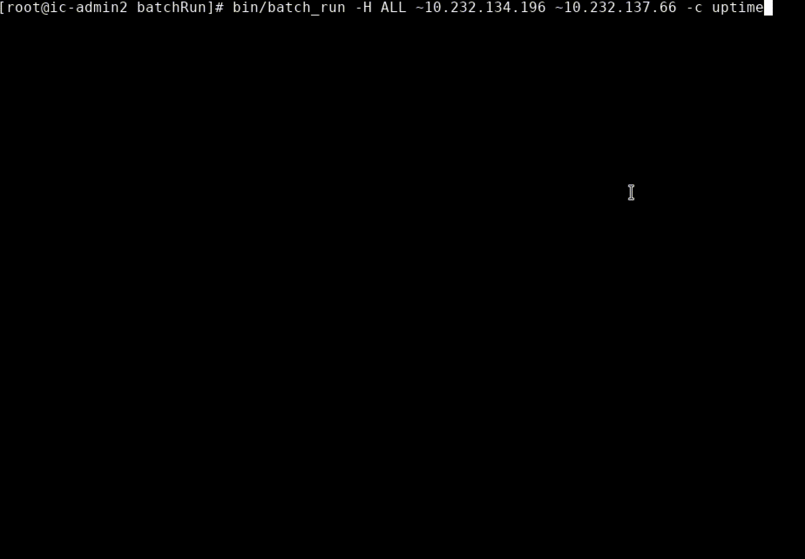
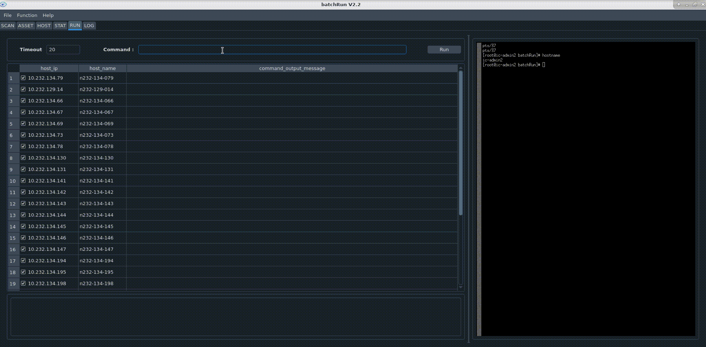

**Version:** V2.2

## What's batchRun?
batchRun is a batch opration, asset management, and information collection tool applied to HPC systems.
You can run batchRun with command line or GUI mode.

## Python dependency
Need python3.12.7
Install python library dependency with command

    pip install -r requirements.txt

## Install
Copy install package into install directory.
Execute below command under install directory.

    python3 install.py

## Quick start
Execute command `batch_run --help` to get usage information.
Execute command `batch_run --gui` to enable GUI mode.
* Below is a demo on how to run command with command line.

   

* Below is a demo on how to run command with GUI.

   

* Below is a demo on how to filter host with OS/CPU/MEM.

   

## Configuration
Come into <BATCH_RUN_INSTALL_PATH>/config directory,

  - Update "config.py" for batchRun basic configuration.
  - Update "host.list" for group-host relationship.
  - Update "password.encrypted" for encrypted user/password information if necessary.

## Sample
Collect host information with tool "sample_host_info".

## Doc
More details please see ["docs/batchRun_user_manual.pdf"](./docs/batchRun_user_manual.pdf)

## Update history
***
| Version | Date      | Update content                             |
|:--------|:----------|:-------------------------------------------|
| V1.0    | (2022.12) | Release original version.                  |
| V1.1    | (2023.07) | Support host_ip & host_name multi-mapping. |
|         |           | Remove LSF supporting.                     |
| V1.2    | (2024.08) | Add host info sampling function.           |
| V2.0    | (2024.10) | Add GUI with GROUP/HOST/RUN/LOG tabs.      |
| V2.1    | (2025.01) | Add SCAN tab on GUI.                       |
|         |           | Add STAT tab on GUI.                       |
|         |           | Add scheduler/cluster/queue on GROUP tab.  |
|         |           | Fix the id authentication bug on crontab.  |
| V2.2    | (2025.02) | Merge GROUP&HOST tabs on GUI.              |
|         |           | Add ASSET tab on GUI.                      |
