# batchRun 用户手册

| 项目 | 内容 |
|------|------|
| Product Name | batchRun |
| Product Version | V2.4 |
| Release Date | 2026.06.14 |
| Contact | @李艳青 (liyanqing.1987@bytedance.com) |

---

## 目录

1. [简介](#一简介)
2. [环境依赖](#二环境依赖)
3. [工具安装、配置及采样](#三工具安装配置及采样)
4. [工具使用](#四工具使用)
5. [辅助工具](#五辅助工具)
6. [技术支持](#六技术支持)
7. [附录](#附录)

---

## 一、简介

### 1.1 功能简介

batchRun 是一款面向 HPC 系统的批量部署和资产管理工具，采用所见即所得的命令执行方式，普遍适用于 RHEL、CentOS、Rocky、Ubuntu 等 Linux 操作系统环境。

batchRun 基于 Python 语言开发，采用 agentless 架构，通过 SSH 协议与被管理主机通讯，配置和使用便捷。

batchRun 支持命令行和图形界面两种使用方式，其中命令行的使用方式侧重于批量部署功能，图形界面的使用方式则同时支持批量部署和资产管理功能。

**系统架构**：

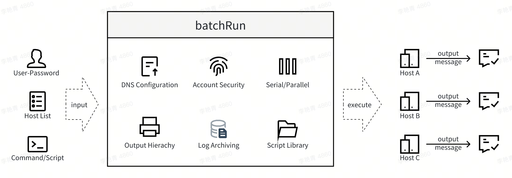

### 1.2 快速了解

#### 1.2.1 命令行模式

batchRun 支持命令行模式，通过参数指定的方式，在 HPC 集群中做任务的批量部署。

跟 ansible 不同的是，batchRun 采用所见即所得的运行方式，不需要借助 playbook 等配置文件，而是直接推送需要运行的 command 到远程服务器上执行，并获取返回结果。

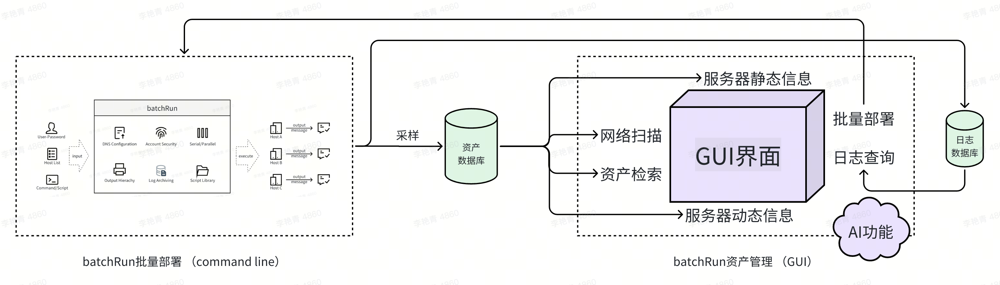

```bash
[root@ic-admin2 batchRun]# bin/batch_run --groups IC_CMP --command "systemctl disable firewalld"
>>> 10.232.135.143
Removed symlink /etc/systemd/system/multi-user.target.wants/firewalld.service.
Removed symlink /etc/systemd/system/dbus-org.fedoraproject.FirewallD1.service.

>>> 10.232.135.144
Removed symlink /etc/systemd/system/multi-user.target.wants/firewalld.service.
Removed symlink /etc/systemd/system/dbus-org.fedoraproject.FirewallD1.service.

Total 2 hosts.  (Runtime: 1 seconds)
```

#### 1.2.2 图形界面模式

batchRun 的图形界面包含 NETWORK/ASSET/HOST/STAT/RUN/LOG/AI 几个页面。

- **NETWORK 页**：在指定业务区域（zone）和网段（network）的前提下，展示网络扫描结果，用于及时发现指定网络内超出业务管理范围的设备（IP）。
- **ASSET 页**：在指定业务资产信息文件的前提下，展示业务资产信息。
- **HOST 页**：在进行了服务器静态信息采样的前提下，展示服务器的 server_type/os/cpu/mem 等软硬件信息，以及 scheduler/cluster/queues 等集群归属信息。
- **STAT 页**：在进行了服务器动态信息采样的前提下，展示服务器的 cpu_load/mem_usage/swap_usage 等负载信息。
- **RUN 页**：在选中的服务器上批量推送执行命令（Command），同时获取并展示命令的输出信息。
- **LOG 页**：按照用户/日期/信息来检索 batch_run 的执行记录。
- **AI 页**：AI 助手对话界面，可以咨询集群状态、主机健康、安全审计、资产信息等问题。

---

## 二、环境依赖

### 2.1 操作系统依赖

batchRun 支持 RHEL/CentOS/Rocky/Ubuntu 等多种 Linux 操作系统。

### 2.2 Python 版本依赖

batchRun 基于 Python 开发，要求 Python >= 3.12。

不同版本的 Python 可能会有库版本问题，按照系统要求安装对应版本的 Python 库即可解决。

### 2.3 系统组件依赖

batchRun 的部分图形界面功能依赖 xterm，xterm 如未安装则可能会造成 GUI 界面中部分组件及功能不可用。

---

## 三、工具安装、配置及采样

### 3.1 工具下载

batchRun 的 GitHub 路径位于 https://github.com/bytedance/batchRun

可以采用 git clone 的方式拉取源代码：

```bash
git clone https://github.com/bytedance/batchRun.git
```

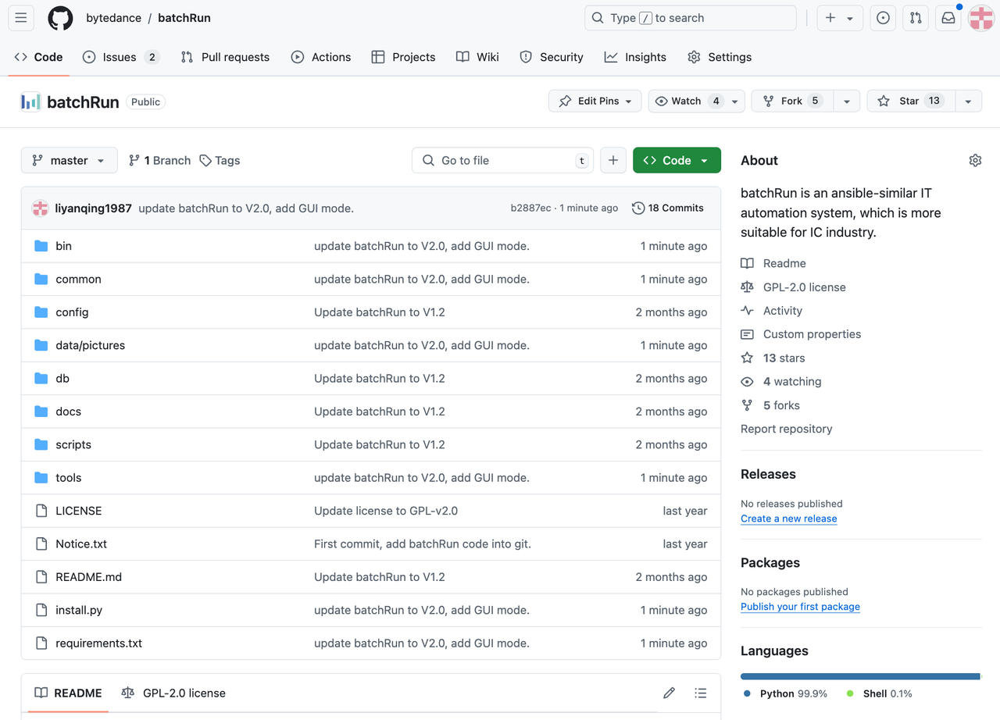

也可以在 batchRun 的 GitHub 页面上，Code → Download ZIP 的方式拉取代码包：

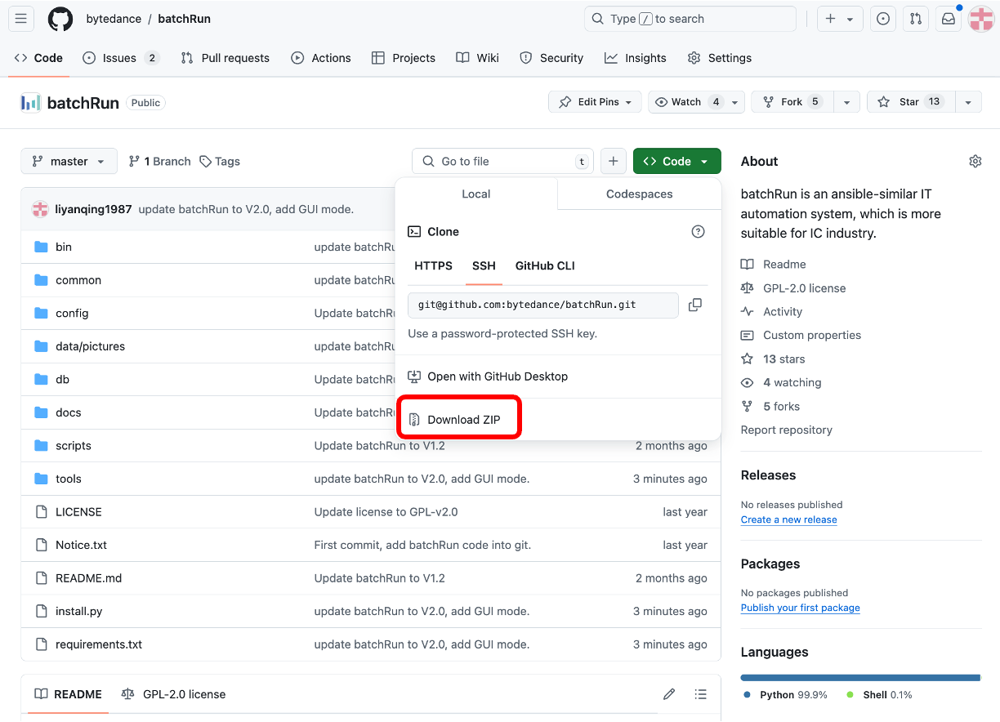

### 3.2 工具安装

工具安装之前，首先参照第二章"环境依赖"满足 batchRun 的环境依赖关系。

batchRun 是 IT 管理员的运维自动化工具，建议用 root 账号将安装包拷贝到安装目录（NAS 最佳），并确保当前服务器有权限 SSH 其它被管理机器。

**步骤 1**：确认 Python 版本正确：

```bash
[root@ic-admin2 batchRun]# which python3
/ic/software/tools/python3/3.12.12/bin/python3
```

**步骤 2**：安装 Python 依赖库：

```bash
pip3 install -r requirements.txt
```

**步骤 3**：运行安装脚本：

```bash
[root@ic-admin2 batchRun]# python3 install.py
>>> Check python version.
    Required python version : (3, 12)
    Current  python version : (3, 12)

>>> Generate script "/ic/software/tools/batchRun/bin/batch_run".
>>> Generate script "/ic/software/tools/batchRun/bin/batch_run_gui".
>>> Generate script "/ic/software/tools/batchRun/tools/encrypt_python".
>>> Generate script "/ic/software/tools/batchRun/tools/network_scan".
>>> Generate script "/ic/software/tools/batchRun/tools/patch".
>>> Generate script "/ic/software/tools/batchRun/tools/sample_host_info".
>>> Generate script "/ic/software/tools/batchRun/tools/sample_host_queue".
>>> Generate script "/ic/software/tools/batchRun/tools/sample_host_stat".
>>> Generate script "/ic/software/tools/batchRun/tools/save_password".
>>> Generate script "/ic/software/tools/batchRun/tools/show_top_file".
>>> Generate script "/ic/software/tools/batchRun/tools/switch_etc_hosts".
>>> Generate config file "/ic/software/tools/batchRun/config/config.py".

Done, Please enjoy it.
```

### 3.3 工具配置

主要的配置文件位于安装目录下的 `config` 目录中。

#### 3.3.1 config/config.py

安装目录下的 `config/config.py` 用于配置工具的基本设置和验证规则。以下是完整配置项及说明：

```python
# Specify host list, default is "host.list" on current configure directory.
host_list = '/ic/software/cad_tools/it/batchRun/config/host.list'

# Specify the database directory.
db_path = '/ic/data/CAD/it/batchRun/db'

# Default ssh command.
default_ssh_command = 'ssh -o StrictHostKeyChecking=no -o ConnectTimeout=10 -t -q'

# Define timeout for ssh command, unit is "second".
serial_timeout = 10
parallel_timeout = 20

# Illegal command list.
illegal_command_list = ['rm -rf /', 'rm -rf ~', 'rm -rf ~/']

# Command for switch_etc_hosts.
switch_etc_hosts_command = '/ic/software/cad_tools/it/batchRun/tools/switch_etc_hosts --input_file /ic/software/cad_tools/it/config_files/hosts/hosts --output_file /ic/data/CAD/it/batchRun/config/host.list --append /ic/software/cad_tools/it/batchRun/config/host.list.append --rewrite --tool batchRun --expected_hosts 10.151.* 10.212.* 10.232.* 10.249.*'

# Command for network_scan.
network_scan_command = '/ic/software/cad_tools/it/batchRun/tools/network_scan --alive'

# Command for sample_host_info.
sample_host_info_command = '/ic/software/cad_tools/it/batchRun/tools/sample_host_info --groups ALL'

# Command for sample_host_queue.
sample_host_queue_command = '/ic/software/cad_tools/it/batchRun/tools/sample_host_queue --groups RUN'

# Command for sample_host_stat.
sample_host_stat_command = '/ic/software/cad_tools/it/batchRun/tools/sample_host_stat --groups RUN'

# Log retention days (auto-cleanup log files older than this).
log_retention_days = 30

# AI helpdesk settings (OpenAI-compatible API).
ai_api_base_url = '<your_api_base_url>'
ai_api_key = '<your_api_key>'
ai_model_name = '<your_model_endpoint>'

# Commands requiring user confirmation before AI executes.
ai_dangerous_commands = [
    'rm', 'rmdir', 'shred', 'truncate',
    'mkfs', 'fdisk', 'parted', 'wipefs', 'dd',
    'kill', 'killall', 'pkill',
    'shutdown', 'reboot', 'poweroff', 'halt', 'init',
    'systemctl', 'service',
    'useradd', 'userdel', 'usermod',
    'passwd', 'chpasswd',
    'iptables', 'firewall-cmd',
    'yum', 'dnf', 'apt', 'rpm', 'pip',
    'bkill', 'badmin', 'bstop', 'bresume',
    'scontrol', 'scancel',
    'crontab', 'mount', 'umount', 'fsck',
]
```

配置项说明：

| 配置项 | 说明 |
|--------|------|
| `host_list` | 指定 host.list 文件位置 |
| `db_path` | 指定数据库路径 |
| `default_ssh_command` | 指定默认 SSH 命令 |
| `serial_timeout` | 串行执行 SSH 超时时间（秒），如经常执行耗时任务可适当调大 |
| `parallel_timeout` | 并行执行 SSH 超时时间（秒） |
| `illegal_command_list` | 违法命令列表，支持正则匹配，batch_run 将拒绝执行 |
| `switch_etc_hosts_command` | GUI 界面上转换 /etc/hosts 到 host.list 的命令 |
| `network_scan_command` | GUI 界面上进行网络扫描的命令 |
| `sample_host_info_command` | GUI 界面上采集服务器静态信息的命令 |
| `sample_host_queue_command` | GUI 界面上采集服务器集群归属信息的命令 |
| `sample_host_stat_command` | GUI 界面上采集服务器动态负载信息的命令 |
| `log_retention_days` | 日志保留天数，超过此天数的日志文件将被自动清理 |
| `ai_api_base_url` | AI API 服务地址（OpenAI 兼容接口），比如 https://ark.cn-beijing.volces.com/api/v3 |
| `ai_api_key` | AI API 密钥 |
| `ai_model_name` | AI 模型名称/端点 |
| `ai_dangerous_commands` | AI 执行前需用户确认的危险命令列表 |

#### 3.3.2 config/host.list

host.list 用于定义所有的机器及其分组信息，是**必须配置项**，否则 batchRun 无法启动。

格式说明：

```ini
#### Format ####
# [group]
# host_ip1
# host_ip2 ssh_port=<ssh_port2>
# host_ip3 ssh_host=<host_name3>
# host_ip4 ssh_host=<host_name4> ssh_port=<ssh_port4>
# sub_group5
# ~host_ip6
# ~host_name7
# ~sub_group8
################
```

基本格式：

| 元素 | 说明 |
|------|------|
| `[group]` | 组名 |
| `host_ip` | 机器（必须） |
| `host_ip ssh_host=<name>` | 机器并指定主机名 |
| `host_ip ssh_port=<port>` | 机器并指定 SSH 端口 |
| `sub_group` | 子组（引入该组的所有主机） |
| `~host_ip` 或 `~host_name` | 排除指定主机 |
| `~sub_group` | 排除指定子组 |

实际示例（节选）：

```ini
[IC_ETX]
10.249.73.96  ssh_host=n249-073-096
10.249.73.236  ssh_host=n249-073-236
10.249.73.237  ssh_host=n249-073-237
10.19.123.194  ssh_host=n019-123-194
10.19.123.195  ssh_host=n019-123-195

[EMU_ETX]
10.19.72.10  ssh_host=n019-072-010
10.19.72.11  ssh_host=n019-072-011

[FPGA_ETX]
10.19.123.214  ssh_host=n019-123-214
10.19.123.215  ssh_host=n019-123-215

[IC_ETX_windows]
10.249.73.194  ssh_host=n249-073-194
10.249.73.195  ssh_host=n249-073-195
```

host.list 的详细编写规则参照 [附2. config/host.list 编写规则](#附2-confighostlist-编写规则)。

host.list 一般基于格式化的 /etc/hosts 文件自动生成，方法参照 [5.2 switch_etc_hosts](#52-switch_etc_hosts)。

建议设置 crontab 来自动定时更新：

```bash
# For batchRun, update config/host.list automatically.
*/30 * * * * /ic/software/cad_tools/it/batchRun/tools/switch_etc_hosts --input_file /ic/software/cad_tools/it/config_files/hosts/hosts --output_file /ic/data/CAD/it/batchRun/config/host.list --append /ic/software/cad_tools/it/batchRun/config/host.list.append --rewrite --tool batchRun --expected_hosts 10.151.* 10.212.* 10.232.* 10.249.*
```

> 建议 host.list 中额外增加一个 "RUN" 组，用于定义日常运维服务器列表，最好确保这些服务器是可 SSH 登陆的。

#### 3.3.3 config/host.list.append

`host.list.append` 用于定义组嵌套关系，在 `switch_etc_hosts` 自动生成 host.list 时，会以文本拼接的方式追加到 host.list 结尾。

组名支持 `*` 通配符进行模糊匹配，例如 `IC_*` 匹配所有以 `IC_` 开头的组。

实际示例：

```ini
[IC]
IC_*

[EMU]
EMU_*

[FPGA]
FPGA_*

[RUN]
ALL
~*_windows
~OTHERS_*
~IC_NAS
~*_VM
```

说明：

- `[IC]` 组包含所有以 `IC_` 开头的子组
- `[RUN]` 组包含所有主机（`ALL`），但排除了 windows 主机、OTHERS 组、NAS 以及 VM 主机
- 这种设计使得日常运维只关注可 SSH 管理的 Linux 服务器

#### 3.3.4 config/network.list

`network.list` 用于定义网络扫描的目标网段，供 `network_scan` 工具使用。

格式为：`<zone_name>    <network_cidr>`

同一个 zone 可以包含多个网段。

实际示例：

```ini
# IDC: lfrz A12-M2402
lfrz_a12_2402    33.76.144.0/26
lfrz_a12_2402    33.76.144.64/26
lfrz_a12_2402_storage    33.76.144.128/26

# Cloud: emu zone
lfrz_a10_emu     10.19.72.0/24
lfrz_a10_emu     10.19.124.0/24
lfrz_a10_emu     10.19.125.0/24

# Cloud: storage
cloud_storage    10.8.142.0/26
cloud_storage    10.8.142.64/26
cloud_storage    33.74.0.128/26

# Cloud: red zone
cloud_red_cmp    10.19.28.0/24
cloud_red_cmp    10.19.29.0/24
cloud_red_cmp    10.19.30.0/24
cloud_red_vm     10.19.31.0/24
cloud_red_etx    10.19.123.192/26
cloud_red_windows    10.249.73.192/28
```

说明：

- zone 名称建议使用 `<idc>_<楼层/位置>` 的命名方式
- 同一 zone 下可以有多个 CIDR 网段
- 被注释（`#`）的行为预留网段，不参与扫描
- 可以按用途区分 zone，如 `cloud_storage`、`cloud_black`、`cloud_red_cmp` 等

#### 3.3.5 密码配置

在使用 batchRun 做多服务器的批量部署时，如果远程服务器没有配置 SSH 免密登陆，则需要使用账号+密码的方式登陆。

密码由工具 `tools/save_password` 生成并加密保存，用法参照 [5.1 save_password](#51-save_password)。

### 3.4 工具采样

如下工具采样是非必须的，但如果某项采样缺失，则在 batchRun 的图形界面上无法看到相关信息。

#### 3.4.1 网络扫描

基于工具 `tools/network_scan`，依赖 `config/network.list` 中的网段定义。

扫描信息默认保存在 `<db_path>/network_scan/network_scan.json` 下。

建议设置 crontab 自动定时扫描：

```bash
# 每天早上 8 点重新扫描网络环境
0 8 * * * /ic/software/cad_tools/it/batchRun/tools/network_scan --alive
```

#### 3.4.2 采集设备静态信息

基于工具 `tools/sample_host_info`，信息默认保存在 `<db_path>/host_info/host_info.json` 下。

```bash
# 每天早上 8 点重新采样所有设备的静态信息
0 8 * * * /ic/software/cad_tools/it/batchRun/tools/sample_host_info --groups ALL
```

#### 3.4.3 采集设备集群归属信息

基于工具 `tools/sample_host_queue`，信息默认保存在 `<db_path>/host_queue/host_queue.json` 下。

```bash
# 每天早上 8 点重新采样设备的集群归属信息
0 8 * * * /ic/software/cad_tools/it/batchRun/tools/sample_host_queue --groups RUN
```

#### 3.4.4 采集设备动态信息

基于工具 `tools/sample_host_stat`，信息默认保存在 `<db_path>/host_stat/` 下。

采样频率过低会导致信息更新滞后，采样频率过高会因为频繁 SSH 导致机器负载过重，可以设定一个合适的频率。

```bash
# 每 10 分钟采集一次设备动态（负载）信息
*/10 * * * * /ic/software/cad_tools/it/batchRun/tools/sample_host_stat --groups RUN
```

默认的动态负载目录 `<db_path>/host_stat` 生成后，将其软连接到安装目录的 `web` 目录下，以确保历史曲线展示功能可以使用：

```bash
ln -s /ic/data/CAD/it/batchRun/db/host_stat web/host_stat
```

#### 3.4.5 准备资产信息

如果公司保有数字化的资产管理系统，可以导出资产信息。资产信息默认保存在 `<db_path>/host_asset/host_asset.json` 下。

推荐格式（第一层 key 必须是 host IP）：

```json
{
    "10.232.135.142": {
        "psm": "ic.orca1.server",
        "idc": "lfrz",
        "rack": "LFRZ_A8_402-14-07",
        "tor": "10.232.128.27",
        "nettype": "25equal",
        "kind": "物理机",
        "package": "S19S1-I8DD2",
        "manufacturer": "Nettrix",
        "asset_no": "2022-nc-srv-004400"
    }
}
```

### 3.5 安装/配置/采样信息说明

| 配置/采样项 | 必须 | 影响 |
|------------|------|------|
| config.py | 按需 | 基本设置 |
| host.list | **必须** | 无此文件 batchRun 无法启动 |
| host.list.append | 按需 | 定义组嵌套和 RUN 组 |
| network.list | 按需 | 未配置则无法进行网络扫描 |
| password | 按需 | 无 SSH 免密时需要 |
| 网络扫描 | 按需 | 未准备则不显示 NETWORK 页 |
| 资产信息 | 按需 | 未准备则不显示 ASSET 页 |
| 设备静态信息 | 建议 | 未采样则 HOST 页内容为空 |
| 设备集群归属 | 建议 | 未采样则集群信息为空 |
| 设备动态信息 | 建议 | 未采样则 STAT 页内容为空 |

---

## 四、工具使用

### 4.1 工具载入

batchRun 的主程序是 `batch_run`，位于安装目录下的 `bin/batch_run`，安装后可以直接引用。

如果配置了 modules，则可以通过 module load 的方式引用：

```bash
[root@ic-admin2 batchRun]# module load cad
[root@ic-admin2 batchRun]# which batch_run
/ic/software/tools/batchRun/bin/batch_run
```

### 4.2 命令行功能介绍

#### 4.2.1 帮助信息

```bash
batch_run -h
```

| 参数 | 说明 |
|------|------|
| `-H, --hosts` | 指定机器列表（IP/hostname/文件），"ALL" 为所有机器 |
| `-G, --groups` | 指定机器组，"ALL" 为所有组 |
| `-L, --list` | 列出指定的 hosts 或 groups |
| `-u, --user` | 指定 SSH 登录用户（默认当前用户） |
| `-p, --password` | 指定 SSH 登录密码 |
| `-c, --command` | 指定要执行的命令 |
| `-P, --parallel` | 指定并行度（0=全并行，1=串行，N=N路并行） |
| `-t, --timeout` | SSH 超时时间（串行默认 10 秒，并行默认 20 秒） |
| `-l, --output_message_level` | 输出级别 0-4 |
| `-o, --output_file` | 输出重定向到文件 |
| `-g, --gui` | 启动 GUI 界面 |
| `-v, --version` | 打印版本信息 |

#### 4.2.2 打印版本信息

```bash
[root@ic-admin2 batchRun]# bin/batch_run --version
Version : V2.4
Release : 2026.06.14
```

#### 4.2.3 列出指定机器

```bash
# 查看所有机器和组
bin/batch_run --list --groups ALL

# 查看指定组
bin/batch_run --list --groups IC_CMP
```

#### 4.2.4 指定用户名和密码登录远程机器

```bash
bin/batch_run --host 10.232.135.143 --user liyanqing.1987 --password *** --command whoami
```

> 因为明文密码会导致敏感信息泄露，并不推荐这种方式，建议配置 SSH 免密登录或采用内置加密密码的方式。

#### 4.2.5 采用内置加密密码登录远程机器

使用 `save_password` 保存加密密码后，batch_run 可以直接使用加密密码登录：

```bash
# 保存加密密码
tools/save_password --password ***

# 之后即可无需输入密码
bin/batch_run --hosts 10.232.135.143 --command whoami
```

> 注意：一定要以密码登陆的方式成为目标用户，否则 batch_run 会无法判断当前实际用户是否知悉该账号密码（比如 root 账号 su 成其他用户并不需要知道密码），从而拒绝执行命令。

#### 4.2.6 指定机器执行命令

支持 IP 地址、hostname，以及模糊匹配：

```bash
# IP 和 hostname 混用
bin/batch_run --hosts 10.232.135.143 n232-135-144 --command hostname

# 模糊匹配（支持 * 和正则）
bin/batch_run --list --hosts *-142
bin/batch_run --list --hosts ^n212-*
```

#### 4.2.7 指定机器组执行命令

```bash
# 指定多个组
bin/batch_run --list --groups IC_CMP FPGA_CMP

# 排除指定 group 或 host
bin/batch_run --list --groups IC_CMP FPGA_CMP --hosts ~10.232.135.143 ~n212-204-142

# 模糊匹配组名
bin/batch_run --list --groups *_CMP
```

#### 4.2.8 执行命令（command）

batch_run 可以在远程机器上执行系统命令或脚本命令。

```bash
bin/batch_run --groups IC_CMP --command hostname --output_message_level 2
```

**自动 SCP 功能**：如果 command/script 在远程机器上不存在，第一次执行失败后，会尝试将 command/script 拷贝到远程机器本地再次执行。

```bash
bin/batch_run --hosts 10.232.158.56 --command /ic/software/cad_tools/bin/test_echo.sh --output_message_level 4
>>> 10.232.158.56
ssh -o StrictHostKeyChecking=no -t -q root@10.232.158.56 /ic/software/cad_tools/bin/test_echo.sh
==== output ====
Command missing, scp and rerun.
This is a test
================
```

**非法命令拦截**：尝试执行 `illegal_command_list` 中定义的非法命令时会被自动拒绝：

```bash
[root@ic-admin2 batchRun]# bin/batch_run --groups ALL --command "rm -rf /"
*Error*: Illegal command!
```

#### 4.2.9 串行执行和并行执行

```bash
# 串行执行（默认）
bin/batch_run --groups IC_ETX IC_CMP --command hostname --parallel 1

# 全并行执行
bin/batch_run --groups IC_ETX IC_CMP --command hostname --parallel 0

# 指定并行度
bin/batch_run --groups IC_ETX IC_CMP --command hostname --parallel 10
```

#### 4.2.10 超时时间（timeout）

串行运行默认 timeout 为 10 秒，并行运行默认为 20 秒。任务执行时间超过 timeout 时，SSH 会报告超时并强制断开连接。

```bash
# 设置更长的 timeout
bin/batch_run --hosts 10.232.135.142 --command "sleep 15; hostname" --timeout 20
```

#### 4.2.11 输出信息层级

| 级别 | 内容 |
|------|------|
| 0 | 仅打印服务器名 |
| 1 | 仅打印命令输出信息（配合 --output_file 使用） |
| 2 | 打印服务器名 + 命令输出首行 |
| 3 | 打印服务器名 + 完整命令输出（默认） |
| 4 | 在 #3 的基础上打印实际 SSH 命令（debug 用） |

#### 4.2.12 输出文件

```bash
# 输出到指定文件
bin/batch_run --hosts 10.232.135.142 --command "free -g" --output_message_level 1 --output_file 10.232.135.142.mem

# 使用 HOST 占位符（自动替换为实际主机名）
bin/batch_run --hosts 10.232.135.142 --command "free -g" --output_message_level 1 --output_file db/host_info/HOST.mem
```

> `--output_file` 中的 "HOST" 字符会被自动替换为实际的 host 名，便于多服务器信息采样的信息保存。

### 4.3 GUI 功能介绍

执行 `batch_run --gui` 可以开启 GUI 界面：

```bash
bin/batch_run --gui
```

#### 4.3.1 菜单栏

- **File 菜单**：包含各个表格的保存功能。
- **Function 菜单**：包含各项采样功能（switch_etc_hosts、network_scan、sample_host_info、sample_host_queue、sample_host_stat）。
- **AI 菜单**：集群分析报告（Cluster Analysis）、安全分析报告（Security Analysis）、Debug 模式开关。
- **Help 菜单**：版本信息和工具简介。

#### 4.3.2 NETWORK 页

NETWORK 页读取和展示 `<db_path>/network_scan/network_scan.json` 中的内容，即指定网络的扫描结果。

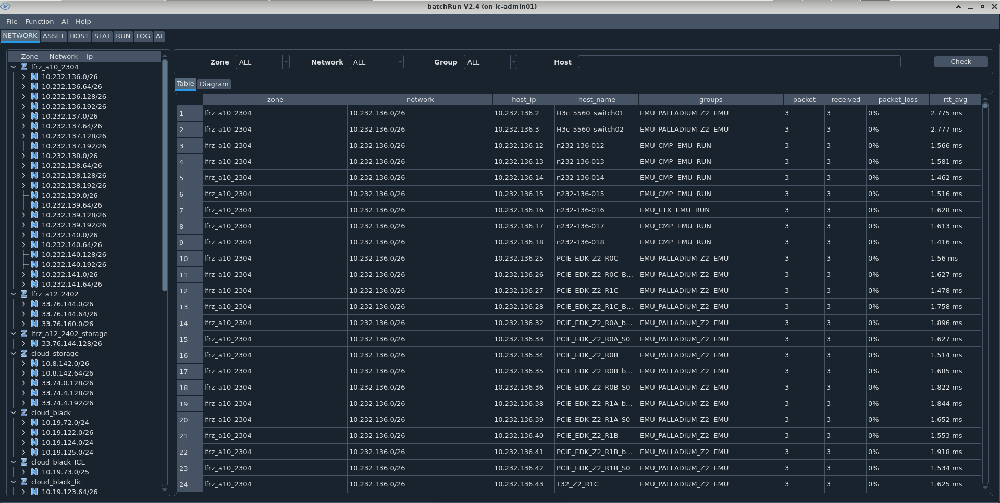

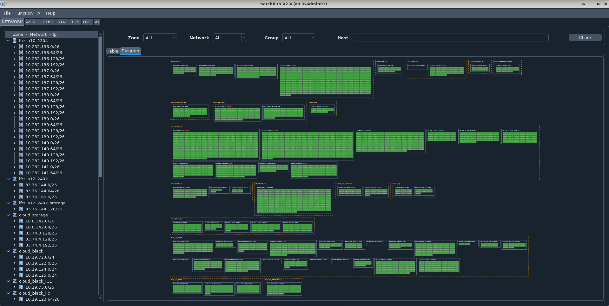

- 左侧侧边栏展示 zone → network → IP 之间的层级关系
- 右侧表格展示所有网络的扫描结果，仅展示可以 ping 通的设备 IP
- 左侧侧边栏内容双击，可以在右侧表格中展示筛选过的内容
- 右侧表格中的设备 IP 如果不在 host.list 中，则背景色为**红色**（非已知设备，需要特别关注）

> 此页仅在存在网络扫描数据时显示。

#### 4.3.3 ASSET 页

ASSET 页读取和展示 `<db_path>/host_asset/host_asset.json` 中的内容。

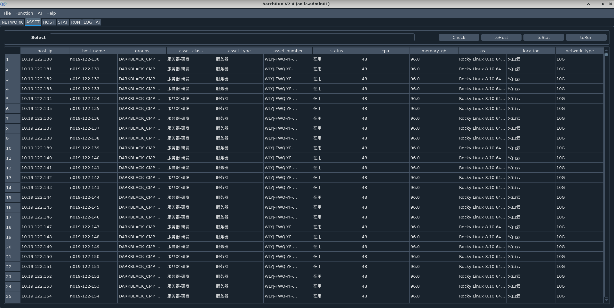

- 表格内容完全由用户提供信息决定（包括标题项）
- 表格中的设备 IP 如果不在 host.list 中，则背景色为**红色**
- Select 项支持 Python 判断语法，例如 `idc == "lfrz"`

> 此页仅在存在资产数据时显示。

#### 4.3.4 HOST 页

HOST 页读取和展示 `<db_path>/host_info/host_info.json` 和 `<db_path>/host_queue/host_queue.json` 内容。

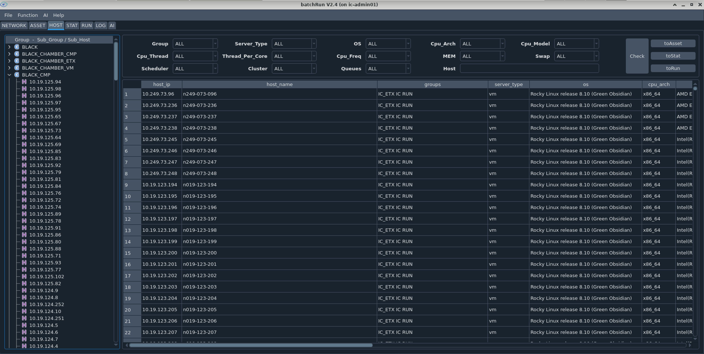

- 左侧侧边栏展示 group → sub_group/sub_host 之间的层级关系
- 右侧表格展示所有设备的静态信息（操作系统、CPU、内存及集群归属信息）
- 左侧侧边栏内容双击，可以在右侧表格中展示筛选过的内容
- 右侧表格标题栏右击，可以指定要展示的列
- 设备如果 SSH 登陆失败或信息采集命令执行失败，则背景色为**红色**

#### 4.3.5 STAT 页

STAT 页读取和展示 `<db_path>/host_stat/host_stat.json` 内容。

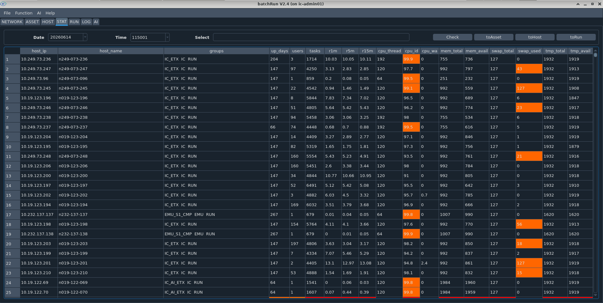

- 表格展示所有设备的动态（负载）信息（启动天数、用户数、任务数、CPU 用量、内存用量、swap 用量、tmp 用量等）
- 默认展示当前最后一次采样数据，也可以选择其它采样数据
- 设备资源用量异常时，背景色会被标记为橘色或红色
- Select 项支持 Python 判断语法，例如 `r1m >= cpu_thread and cpu_id < 90`
- 双击 host_ip 可查看指定服务器的历史 stat 变化曲线

#### 4.3.6 RUN 页

RUN 页用来在选中的设备上统一推送执行命令，强制为并行推送。

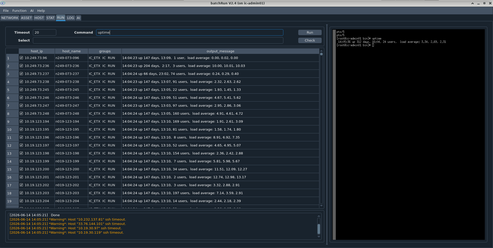

- 如果 host.list 中存在名为 "RUN" 的组，则 RUN 页默认导入 "RUN" 组中的服务器列表，否则导入全量服务器列表
- 左侧为任务推送区域
- 右侧为内嵌的 xterm 工具，可以将需要推送的命令在本地测试
- 执行命令后的 output_message 可以通过 Select 检索框进行结果过滤
- 非法命令会被拒绝执行
- 默认 timeout 为 20s，针对耗时较长的命令需要手工调长
- 每个 host_ip 都可以单独选中或者取消，只有选中的 host_ip 上才会尝试执行命令
- 针对 SSH timeout 或 hostname 不一致的情况，会以 Warning/Error 信息提示
- Select 项支持 Python 判断语法，例如 `output_message and output_message != host_name`

#### 4.3.7 LOG 页

LOG 页用来检索和查询 batchRun 的操作记录。

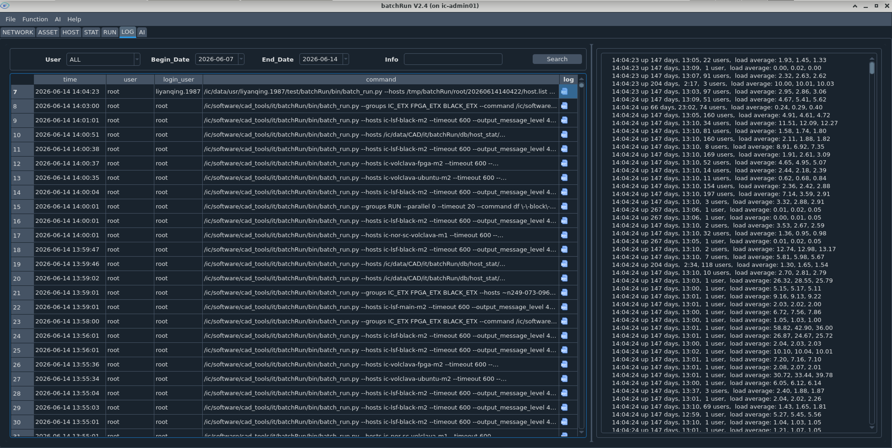

- 左侧表格展示筛选结果
- 右侧文本区展示具体操作记录的 Log 内容
- root 账号可以查看所有人的操作记录，普通账号仅可以查看自己的操作记录
- 支持按用户、日期、Info 搜索操作记录
- 日志保留天数由 `config.py` 中的 `log_retention_days` 控制

#### 4.3.8 AI 页

AI 页是 batchRun 集成的 AI 助手对话界面，可以直接咨询集群相关问题。

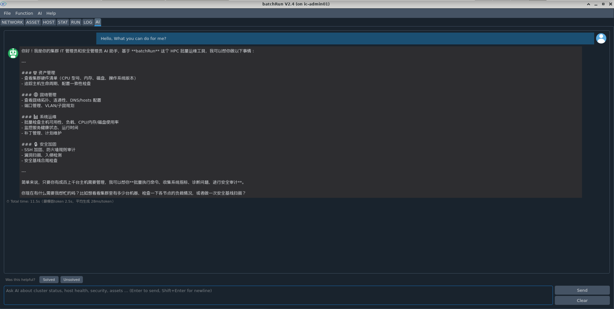

功能：
- 基于 OpenAI 兼容 API 的对话式助手
- 支持查询集群状态、主机健康、安全信息、资产信息等
- AI 可以调用 batchRun 内置的 skills（技能）来执行实际操作
- 对于 `ai_dangerous_commands` 中定义的危险命令，AI 执行前会弹出确认对话框
- 提供用户反馈机制（Solved/Unsolved）用于评估 AI 回答质量
- AI Debug 模式可通过 AI 菜单中的 Debug 选项开启，用于查看 AI 的详细推理过程
- 输入框支持多行输入（Shift+Enter 换行，Enter 发送）

配置要求：需要在 `config/config.py` 中正确设置 `ai_api_base_url`、`ai_api_key`、`ai_model_name` 三个参数，否则 AI 页会提示未配置。

**AI 菜单功能**：

除了 AI 页的对话功能外，AI 菜单还提供两项自动化分析报告：

**集群分析报告（Cluster Analysis）**：

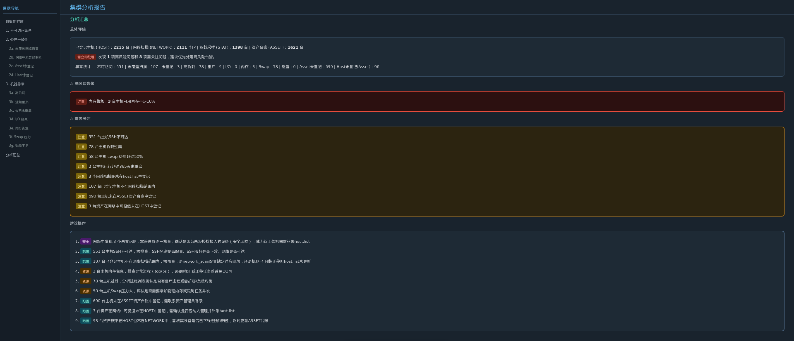

自动分析集群状态：
- SSH 连通性测试
- 资产信息一致性检查
- 机器异常检测

**安全分析报告（Security Analysis）**：

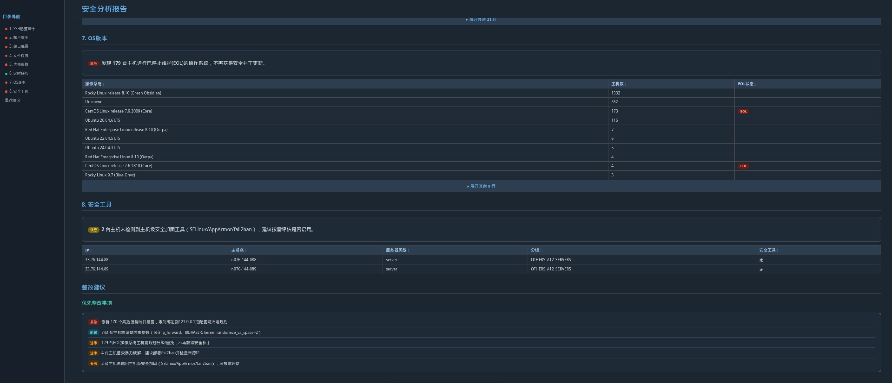

自动执行安全审计：
- SSH 配置检查
- 账户安全审计
- 端口扫描
- 文件权限检查
- 内核参数审计
- 定时任务检查
- OS 补丁状态
- 安全工具检测

---

## 五、辅助工具

batchRun 的辅助工具位于 `tools` 目录下。

### 5.1 save_password

工具 `save_password` 用于将当前用户密码加密保存，供 batchRun 远程 SSH 登陆时使用。

```bash
tools/save_password --help
```

| 参数 | 说明 |
|------|------|
| `--password` | 指定用户明文密码 |
| `--host` | 指定密码生效的机器名，默认 "default"（对所有机器生效） |
| `--output_file` | 指定输出文件，默认为 `<db_path>/password/<user>` |

示例：

```bash
# 为所有机器保存通用密码
tools/save_password --password ***

# 为指定机器保存密码
tools/save_password --password *** --host ic-monitor01
```

### 5.2 switch_etc_hosts

工具 `switch_etc_hosts` 用于将格式化的 `/etc/hosts` 文件转换为 batchRun 的 host.list 文件。

```bash
tools/switch_etc_hosts --help
```

| 参数 | 说明 |
|------|------|
| `--expected_ips` | 指定期望的 IP（支持正则），不在列表中的 IP 会被抛弃 |
| `--excluded_ips` | 指定排除的 IP |
| `--input_file` | 输入 hosts 文件来源，默认 "/etc/hosts" |
| `--output_file` | 输出 host.list 文件路径，默认 "./host.list" |
| `--append` | 追加文件（用于指定组嵌套关系） |
| `--rewrite` | 强制覆盖模式 |
| `--tool` | 输出格式（batchRun/ansible） |

`/etc/hosts` 文件需要符合如下格式：

```
# GROUP : <group>
<host_ip> <host_name>
<host_ip> <host_name> # SSH_PORT=<port>
```

示例：

```bash
# 转换 hosts 文件并追加组嵌套配置
tools/switch_etc_hosts --input_file config/hosts --output_file config/host.list --rewrite --tool batchRun --append config/host.list.append --expected_hosts 10.151.* 10.212.* 10.232.* 10.249.*
```

### 5.3 network_scan

工具 `network_scan` 用于扫描指定网络，依赖 `config/network.list` 的网段定义。

```bash
tools/network_scan --help
```

| 参数 | 说明 |
|------|------|
| `--alive` | 仅展示活动状态的系统 |
| `--parallel` | 指定并行度，默认 1000 |
| `--debug` | 开启 debug 模式 |
| `--input_file` | 网络设置文件，默认 "config/network.list" |
| `--output_file` | 输出文件，默认 `<db_path>/network_scan/network_scan.json` |

示例：

```bash
tools/network_scan --alive
```

输出文件格式：

```json
{
    "lfrz_a10_2304": {
        "10.232.136.0/26": {
            "10.232.136.12": {
                "connectivity": true,
                "packet": 3,
                "received": 3,
                "packet_loss": "0%",
                "rtt_avg": 0.095,
                "rtt_unit": "ms"
            }
        }
    }
}
```

### 5.4 sample_host_info

工具 `sample_host_info` 用于采集服务器的 OS 和硬件信息。

```bash
tools/sample_host_info --help
```

| 参数 | 说明 |
|------|------|
| `--hosts` / `--groups` | 指定目标主机 |
| `--user` | 指定用户 |
| `--password` | 指定密码 |
| `--parallel` | 指定并行度，推荐 "0"（全部并行） |
| `--timeout` | SSH 超时时间 |
| `--output_dir` | 输出路径，默认 `<db_path>/host_info` |

输出 host_info.json 格式：

```json
{
    "10.232.135.142": {
        "host_name": ["n232-135-142"],
        "groups": ["IC_ETX"],
        "server_type": "server",
        "os": "CentOS Linux release 7.9.2009 (Core)",
        "cpu_architecture": "x86_64",
        "cpu_thread": 64,
        "thread_per_core": 1,
        "cpu_model": "Intel(R) Xeon(R) Platinum 8336C CPU @ 2.30GHz",
        "cpu_frequency": 3.0,
        "cpu_frequency_unit": "GHz",
        "mem_size": 503,
        "mem_size_unit": "GB",
        "swap_size": 127,
        "swap_size_unit": "GB"
    }
}
```

### 5.5 sample_host_queue

工具 `sample_host_queue` 用于采集服务器的集群归属信息（LSF/openlava）。

```bash
tools/sample_host_queue --help
```

参数与 `sample_host_info` 类似，额外参数：

| 参数 | 说明 |
|------|------|
| `--host_info_json` | 指定 host_info.json 文件路径 |
| `--output_dir` | 输出路径，默认 `<db_path>/host_queue` |

输出 host_queue.json 格式：

```json
{
    "10.232.135.142": {
        "scheduler": "LSF_10.1.0.12",
        "cluster": "IC_CLUSTER",
        "queues": ["orca", "orca_ana"]
    }
}
```

### 5.6 sample_host_stat

工具 `sample_host_stat` 用于采集服务器的 cpu_load/mem_usage/swap_usage 等负载信息。

```bash
tools/sample_host_stat --help
```

参数与 `sample_host_queue` 类似，输出路径默认为 `<db_path>/host_stat`。

输出 host_stat.json 格式：

```json
{
    "10.232.135.142": {
        "host_name": ["n232-135-142"],
        "groups": ["IC_ETX"],
        "up_days": 165,
        "users": 1,
        "tasks": 722,
        "r1m": 0.01,
        "r5m": 0.04,
        "r15m": 0.05,
        "cpu_thread": 64,
        "cpu_id": 98.3,
        "cpu_wa": 0.0,
        "mem_total": 503,
        "mem_used": 6,
        "mem_free": 482,
        "mem_shared": 0,
        "mem_buff": 13,
        "mem_avail": 494,
        "swap_total": 127,
        "swap_used": 3,
        "swap_free": 124,
        "tmp_total": 1979,
        "tmp_used": 1,
        "tmp_avail": 1979
    }
}
```

### 5.7 patch

工具 `patch` 用于帮助 batchRun 打补丁（增量更新）。

```bash
tools/patch -h
```

| 参数 | 说明 |
|------|------|
| `--patch_path` | 指定补丁包（新安装包）路径 |

示例：

```bash
tools/patch -p ~/batchRun-master
```

---

## 六、技术支持

本工具为开源工具，由开源社区维护，可以提供如下类型的技术支持：

- 部署和使用技术指导
- 接收 bug 反馈并修复
- 接收功能修改建议（需审核和排期）

获取技术支持的方式：

- 通过 Contact 邮箱联系开发者
- 添加作者微信 "liyanqing_1987"，注明"真实姓名/公司/batchRun"，由作者拉入技术支持群


---

## 附录

### 附1. 变更历史

| 日期 | 版本 | 变更描述 |
|------|------|----------|
| 2022.12 | V1.0 | 发布第一个正式 release 版本 |
| 2023.07 | V1.1 | 增加对 host_ip 和 host_name 的多对多映射关系的支持；去除对 LSF queue 机器获取的支持 |
| 2024.08 | V1.2 | 增加服务器信息采样功能 |
| 2024.10 | V2.0 | 增加 GUI 界面，包含 GROUP/HOST/RUN/LOG 四个界面 |
| 2025.01 | V2.1 | GUI 增加 SCAN 页（网络扫描结果）；GUI 增加 STAT 页（服务器动态信息）；GROUP 页增加 scheduler/cluster/queue 信息；解决 crontab 环境中身份认证的 bug |
| 2025.02 | V2.2 | GUI 合并 GROUP 和 HOST 页；GUI 增加 ASSET 页（资产信息）；支持 host/group 模糊匹配；RUN 页默认读取 "RUN" 组服务器列表；增加 illegal command 检查功能 |
| 2025.12 | V2.3 | GUI STAT 页增加指定服务器的历史 stat 曲线展示 |
| 2026.06 | V2.4 | 新增 AI 页：AI 助手对话（支持 skills 调用）；AI 菜单增加集群分析报告（SSH连通性+资产一致性+机器异常）和安全分析报告（SSH配置/账户/端口/文件权限/内核/定时任务/OS/安全工具）；新增 AI 危险命令确认机制；新增日志自动清理功能（log_retention_days） |

### 附2. config/host.list 编写规则

#### "group" 编写规则

group 为一组机器的组名，一般用大写，不能包含空格，在 host.list 中用 `[]` 括起来，比如 `[LOGIN]` 或者 `[COMPUTING]`。

#### "host" 编写规则

host 包含如下 4 种写法：

```
host_ip1
host_ip2 ssh_port=<ssh_port2>
host_ip3 ssh_host=<host_name3>
host_ip4 ssh_host=<host_name4> ssh_port=<ssh_port4>
```

- `host_ip` 是必选项，是 host 的确定标识
- `host_name` 是可选项，主要用于标识 DNS 映射关系，不能包含空格
- `ssh_port` 是可选项，如果 host_ip 的 SSH 端口不是 22，则需要指定

> 为保持和 /etc/hosts 的兼容，host_ip 和 host_name 是多对多的对应关系。

#### "sub_group" 编写规则

sub_group 为多机器的组名，不能包含空格，必须在 host.list 文件中被定义过。支持 `*` 通配符匹配，例如 `IC_*` 匹配所有以 `IC_` 开头的组。

#### "excluded_host" 编写规则

在前面加上波浪线 `~` 即可排除 host：

```ini
[group]
~host_ip6
~host_name7
```

- `~host_ip`：按 host_ip 维度排除
- `~host_name`：按 host_name 维度排除（如果某个 host_ip 对应的机器名匹配，则该 host_ip 被排除）

#### "excluded_sub_group" 编写规则

在前面加上波浪线 `~` 即可排除子组，同样支持 `*` 通配符：

```ini
[group]
~sub_group8
~*_windows
```

### 附3. batchRun 检查功用

batchRun 除了批量部署和资产管理外，因其强大的信息采集能力和信息展示/筛选能力，可以用于各种检查来发现设备问题：

**发现非法设备**：NETWORK 页中扫描到的设备未在 host.list 中记录，被标记为红色背景。一般原因：
- 设备已知，host.list 中未记录（补充即可）
- 设备未知，不受当前 IT 管理员管辖（存在网络安全漏洞，需尽快移除或网络屏蔽）

**发现未配置资产**：ASSET 页中设备未在 host.list 中记录，被标记为红色背景。一般原因：
- 资产已移除，公司资产管理系统未更新（督促更新）
- 资产存在，host.list 中未记录（补充即可）

**发现错误系统配置**：通过 HOST 页的属性筛选确认设备静态信息是否符合配置要求，典型例子：
- Login 节点关闭超线程（一般要求打开）
- Computing 节点打开超线程（一般要求关闭）
- 物理服务器未开启超频（默认应开启）
- 物理服务器未配置独立 /tmp
- 物理服务器未设置 swap

**发现设备状态异常**：STAT 页中筛选出异常设备（被标记为橘色或红色），典型异常：
- `r1m > cpu_thread`：CPU load 过高，导致卡顿
- `cpu_id` 过低或过高：过载或闲置
- `cpu_wa` 过高：I/O 对 CPU 性能形成瓶颈
- `mem_avail` 过低：可用内存不足，可能导致 OOM
- `swap_used` 过高：程序运行效率下降
- `tmp_avail` 过低：临时数据写失败
- `users` 和 `tasks` 均过小且 `r1m` 接近 0、`cpu_id` 接近 100：机器闲置
